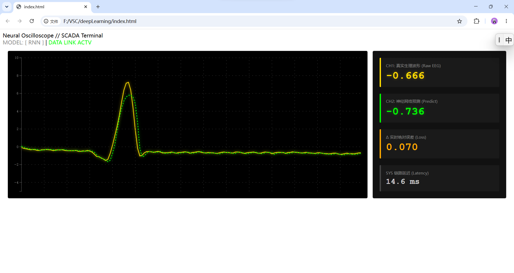
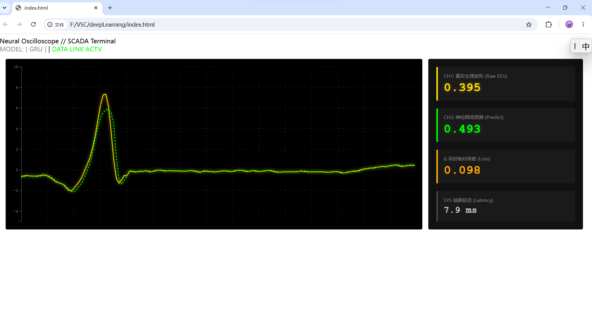
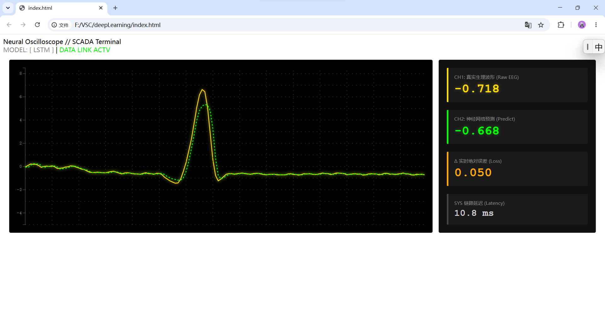

# Deep Learning Foundations — RNN / GRU / LSTM for Real-Time Physiological Signal Prediction

> **From theory to visualization: PyTorch implementations of classic recurrent architectures, validated on real ECG data and streamed live to a browser-based oscilloscope.**

---

## 💡 Motivation

While working on embodied intelligence and SLAM systems, I developed a deep curiosity about the foundational building blocks of deep learning. This repo is my hands-on laboratory for understanding recurrent neural architectures from the ground up — implementing, training, and visually diagnosing RNNs, GRUs, and LSTMs on real-world physiological signals.

---

## 🔬 Key Highlights

### Classic Models Reproduced

- **Vanilla RNN (Elman Network)** — the simplest recurrent architecture, serving as the baseline for understanding vanishing-gradient limitations
- **GRU (Gated Recurrent Unit)** — a lighter gated alternative to LSTM with fewer parameters, balancing efficiency and memory capacity
- **LSTM (Long Short-Term Memory)** — the workhorse of sequence modeling, with explicit forget/input/output gates for long-range dependency capture

All three architectures share a **unified model factory** (`SleepRNNDemo` in [models.py](models.py)), making it possible to swap cell types with a single string parameter while keeping every other hyperparameter identical — enabling rigorous, controlled architecture comparisons.

### Framework & Stack

| Layer | Technology | Why |
|---|---|---|
| **Deep Learning** | PyTorch | Dynamic computation graphs, intuitive debugging, strong GPU support |
| **Data Pipeline** | `wfdb` + NumPy | Native PhysioNet format parsing for MIT-BIH ECG records |
| **Real-Time Streaming** | WebSocket (`websockets`) | Low-latency server→browser telemetry push (~30 FPS) |
| **Frontend Visualization** | D3.js v7 (bundled) | High-performance SVG rendering; zero external dependencies |
| **Layout** | Vanilla HTML5 / CSS3 Flexbox | Responsive oscilloscope + SCADA-style telemetry panel |

### Training Features

- ✅ Full-dataset training on ~650,000 real ECG samples (MIT-BIH Record 100)
- ✅ Sliding-window sampling with 75% overlap — the model sees every phase alignment
- ✅ Time-ordered 80/20 train/val split — no future information leakage
- ✅ Mini-batch training (GPU-compatible) with gradient clipping
- ✅ ReduceLROnPlateau learning rate scheduling
- ✅ Early stopping with configurable patience
- ✅ Checkpoint resume — survives HPC preemption and power loss
- ✅ Best-model export (by validation loss), not just last-epoch weights

---

## 🖼️ Visuals

### Training Loss Curves

After running `python train.py`, the console prints per-epoch train/val loss. For publication-quality plots, run:

```python
# Quick plot snippet — add to the end of train.py or run interactively
import matplotlib.pyplot as plt
# (record train_loss / val_loss per epoch into lists, then:)
plt.plot(train_losses, label='Train Loss')
plt.plot(val_losses, label='Val Loss')
plt.xlabel('Epoch'); plt.ylabel('MSE')
plt.legend(); plt.title(f'{MODEL_TYPE} — MIT-BIH ECG Prediction')
plt.savefig(f'MIT-BIH_data/result/MIT-BIH_{MODEL_TYPE}_training_curve.png', dpi=150)
```

### Architecture Comparison

| RNN | GRU | LSTM |
|---|---|---|
|  |  |  |

> *Generated result images will appear here after training each architecture. Run `python train.py` with `MODEL_TYPE='RNN'`, `'GRU'`, and `'LSTM'` respectively, then save the comparison plots to `MIT-BIH_data/result/`.*

**How to see it live:**
1. `python train.py` — train a model (or use pre-trained weights in `MIT-BIH_data/weight/`)
2. `python sever.py` — start the WebSocket inference server
3. Open `index.html` in any modern browser — waveforms appear immediately

---

## 📂 Project Structure

```
deepLearning/
├── train.py                        # Training script: full MIT-BIH → RNN/GRU/LSTM
├── models.py                       # Unified model factory (shared by train & inference)
├── data_loader.py                  # Signal I/O + sliding-window DataLoader pipeline
├── sever.py                        # WebSocket inference server (edge-computing terminal)
├── index.html                      # D3.js oscilloscope + SCADA telemetry panel
├── d3.v7.min.js                    # D3.js v7 local copy (273 KB, no CDN needed)
├── requirements.txt                # Python dependencies
├── 100.dat / 100.hea / 100.atr     # MIT-BIH Arrhythmia Database Record 100
└── MIT-BIH_data/
    ├── weight/                     # Pre-trained weights (.pth)
    │   ├── sleep_rnn_weights.pth
    │   ├── sleep_gru_weights.pth
    │   └── sleep_lstm_weights.pth
    └── result/                     # Training curves & comparison plots
```

---

## 🚀 Quick Start

### Prerequisites

- Python 3.10+
- A modern browser (Chrome / Edge / Firefox)
- (Optional) NVIDIA GPU with CUDA 12.4 for faster training

### 1. Install Dependencies

```bash
# Create and activate a virtual environment
python -m venv .venv
source .venv/bin/activate      # Linux/macOS
# .venv\Scripts\activate       # Windows

# CPU-only (no GPU required)
pip install --index-url https://download.pytorch.org/whl/cpu -r requirements.txt

# GPU (CUDA 12.4, recommended for training)
pip install torch torchvision torchaudio --index-url https://download.pytorch.org/whl/cu124
pip install -r requirements.txt
```

### 2. Train a Model

```bash
python train.py
```

Edit `MODEL_TYPE` at the top of [train.py](train.py) to switch architectures:
```python
MODEL_TYPE = 'LSTM'   # 'RNN' | 'GRU' | 'LSTM'
```

Training takes ~3–5 minutes on CPU for the full dataset; significantly faster on GPU.

### 3. Launch the Inference Server

```bash
python sever.py
```

Expected output:
```
=============================================
  [SYS] 工业级边缘计算遥测终端已启动
  [SYS] 当前挂载计算核心: LSTM 神经网络
  [SYS] 数据来源: MIT-BIH 心律失常数据库 Record 100 (真实生理信号)
  [SYS] 监听端口: ws://127.0.0.1:8765
=============================================
```

### 4. Open the Monitoring Panel

Open `index.html` directly in a browser. The status indicator switches from **SYS OFFLINE** → **DATA LINK ACTV**, and dual-channel waveforms begin rendering in real time.

> No internet connection is required — D3.js is bundled locally, and the WebSocket connects to `localhost`.

---

## 🧪 Run Unit Tests

Each Python module includes `__main__` self-checks:

```bash
python data_loader.py   # Verify signal loading, windowing, DataLoader pipeline
python models.py        # Verify RNN/GRU/LSTM instantiation & forward pass shapes
```

---

## 🎯 Research Significance

### Why Real-Time Visualization Matters

Scalar loss metrics (MSE, MAE) summarize performance in one number, but they hide the *dynamics* of prediction error. A model with low MSE can still exhibit:

- **Phase lag** — the prediction tracks the correct shape but is shifted in time
- **Amplitude drift** — the envelope decays or explodes relative to ground truth
- **Transient blindness** — failure during sudden waveform changes (e.g., arrhythmic beats) despite good performance on regular rhythms

The oscilloscope panel makes these failure modes **immediately visible**, providing qualitative debugging that complements quantitative evaluation.

### Why a Real Physiological Benchmark

MIT-BIH is one of the most widely cited datasets in biomedical signal processing. Training on real ECG data — not synthetic sine waves — ensures the learned dynamics reflect actual biological signal characteristics, making the results relevant to anomaly detection, denoising, and compression applications.

---

## 📚 Data Source

Data files `100.dat`, `100.hea`, `100.atr` come from the **MIT-BIH Arrhythmia Database** ([PhysioNet](https://physionet.org/content/mitdb/1.0.0/)), a gold-standard public benchmark in physiological signal processing. Record 100 contains ~30 minutes of dual-lead ambulatory ECG sampled at 360 Hz (~650,000 sample points). The MLII lead is extracted and Z-score normalized.

---

## 📝 Notes

- Start `sever.py` before opening `index.html`, or the panel will show **SYS OFFLINE**.
- `index.html` uses a local copy of `d3.v7.min.js` — zero external network dependencies.
- Training requires the MIT-BIH data files (`100.dat`, `100.hea`, `100.atr`) in the project root.
- Full-dataset training takes ~3–5 minutes on CPU; a GPU significantly reduces wall-clock time.
- Set `MODEL_TYPE` consistently in both `train.py` and `sever.py` when switching architectures.
